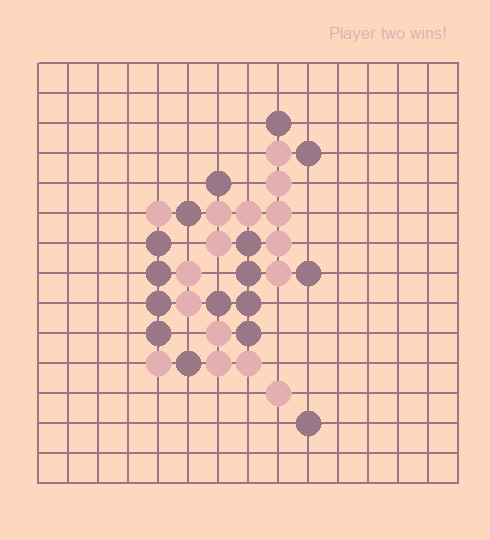
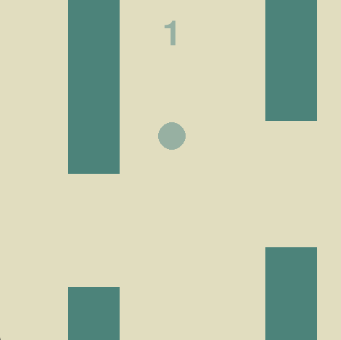
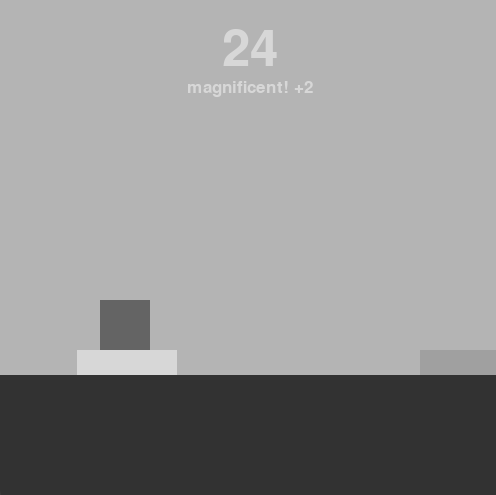
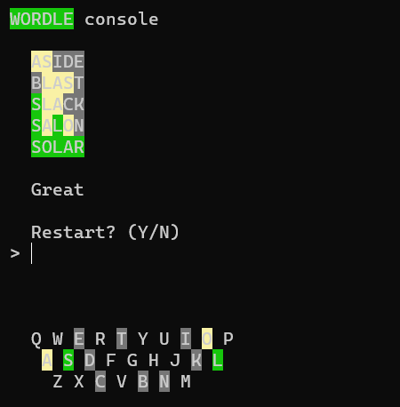
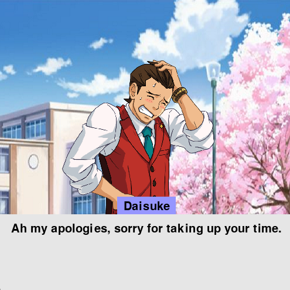
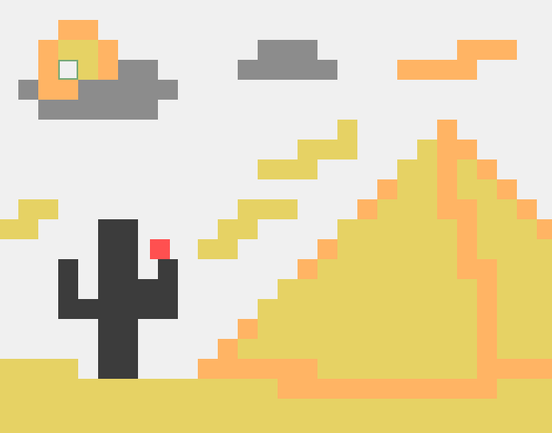

# APCSP Projects

    
    
    

    
    
    

This repository  is a collection of projects I created in my AP Computer Science Principles class during my sophomore year. We were given around two to four weeks of work time during class for each project. I thoroughly enjoyed my time making these projects and often found myself working on them outside of class out of my interest. Having been fascinated by programming ever since I was young, this class not only enabled me to expand my knowledge but also ignited a sense of creativity within me.

This repository includes:
* omok
* bounce!
* jump!
* WORDLE console
* whatever this game is called (an interactive novel)
* colors

Read more about each project on my [website](https://danielkshin.github.io/APCSP-Projects).

The source code for each project is available in the repository, which has unedited code from my sophomore year. I plan on cleaning up and reworking some of the projects in the future.